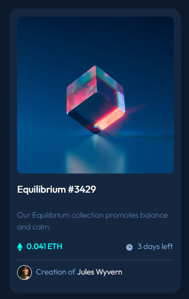

# Frontend Mentor - NFT preview card component solution

This is a solution to the [NFT preview card component challenge on Frontend Mentor](https://www.frontendmentor.io/challenges/nft-preview-card-component-SbdUL_w0U). Frontend Mentor challenges help you improve your coding skills by building realistic projects. 

## Table of contents

- [Overview](#overview)
  - [The challenge](#the-challenge)
  - [Screenshot](#screenshot)
  - [Links](#links)
- [My process](#my-process)
  - [Built with](#built-with)
  - [What I learned](#what-i-learned)
- [Author](#author)

## Overview

### The challenge

Users should be able to:

- View the optimal layout depending on their device's screen size
- See hover states for interactive elements

### Screenshot



### Links

- Solution URL: [Solution URL](https://www.frontendmentor.io/solutions/html-css-bootstrap-solution-B2_FQmfIYz)
- Live Site URL: [live site URL](https://sonnen99.github.io/Challenge-nft-preview-card-component-main/)

## My process

### Built with

- Semantic HTML5 markup
- CSS custom properties
- Bootstrap for card design
- Mobile-first workflow
- Refactoring

### What I learned
Creating an overlay for the card image.

```css
.img-hover-overlay {
    cursor: pointer;
    background-color: #00FFF8;
    opacity: 0;
    visibility: hidden;
    position: absolute;
    top: 0;
    left: 0;
    display: flex;
    width: 20rem;
    height: 20rem;
    align-items: center;
    justify-content: baseline;
    border-radius: 10px;
    transition: opacity 0.3s ease, visibility 0.3s ease;
    z-index: 1;
}
```

## Author
- Frontend Mentor - [sonnen99](https://www.frontendmentor.io/profile/sonnen99)